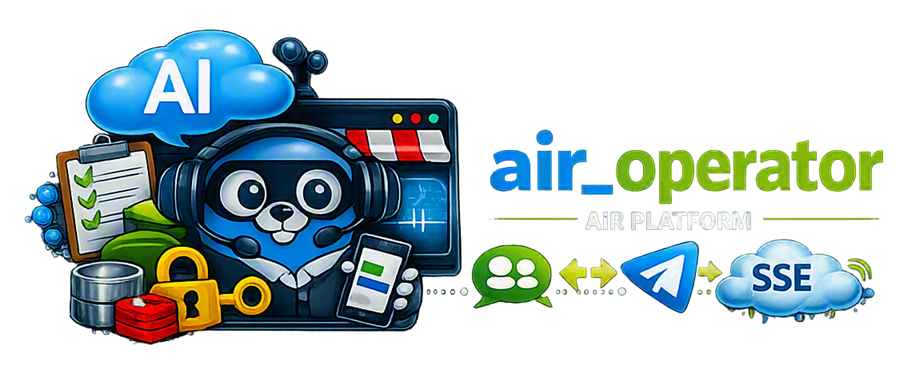

# AiR Operator



[🇷🇺 Russian version](README.ru.md)


[](https://t.me/marusia_dev)

The operator microservice of the AiR platform. The service connects the client interface with operators in Telegram: it receives user messages, forwards them to an operator, and sends the responses back via Server-Sent Events (SSE).

## Features

- launching the operator-mode Telegram bot;
- synchronizing the list of active operators from MySQL;
- forwarding messages between the client and the operator;
- streaming operator responses via SSE;
- sending text, commands, and files to Telegram;
- ending a dialog and returning the user to AI mode;
- retrieving dialog history for an operator session;
- Prometheus metrics, structured logging, and graceful shutdown.

## Architecture

```text
Client / AI layer
        |
        | HTTP: SSE / JSON
        v
  air_operator (:8080)
        |                |
        |                +--> Telegram Bot API
        |
        +--> MySQL
        |
        +--> air_orchestrator (gRPC)
             bot configuration and MasterKey
```

At startup, the service obtains the Telegram bot configuration via the `air_orchestrator` gRPC client, connects to MySQL, and loads the active operators. The operator list is then updated approximately every 40 seconds or whenever changes occur in the database.

## HTTP API

The HTTP server listens on port `8080`.

```text
GET  /metrics
GET  /oper/available
GET  /op?user_id={user_id}&dialog_id={dialog_id}
POST /op
```

`GET /op` opens an SSE connection for a specific user and dialog. Events include operator messages and service events indicating the end of a session.

`POST /op` accepts JSON:

```json
{
  "user_id": 123,
  "dialog_id": 456,
  "sid": 789,
  "msg": {
    "type": "user",
    "content": {}
  }
}
```

The full API description is available in [`doc/openapi.yaml`](doc/openapi.yaml).

## Technologies

- Go `1.25.8`;
- the standard `net/http` package;
- MySQL;
- gRPC for communication with `air_orchestrator`;
- Telegram Bot API via `gopkg.in/telebot.v4`;
- Server-Sent Events (SSE);
- Prometheus;
- Docker and Docker Compose;
- `air_common` — shared models, configuration, RPC, and database access;
- `air_logger` — logging.

## Running

For development:

```bash
docker compose -f dev.yml up --build
```

For production:

```bash
docker compose -f prod.yml up -d
```

The service connects to the external Docker networks `air_shared` and `monitoring_shared`. MySQL must be available on the network under the name `air_db`, and the `air_orchestrator` gRPC service under the name `airorc`.

## Configuration

Main environment variables:

```text
DB_HOST=air_db:3306
DB_NAME=air
DB_USER
DB_PASSWORD
GRPC_CONFIG_HOST=airorc:50051
SERVICE_KEY_FILE=/run/secrets/service_key
HISTORY_LIMIT_MESSAGES=20
LOG_LEVEL=info
REAL_URL
```

`SERVICE_KEY_FILE` points to the service key file used for secure communication with `air_orchestrator`. The Telegram bot configuration is loaded via gRPC and is not specified directly in Docker Compose.

## Project Structure

- `cmd/main.go` — entry point;
- `internal/app` — application initialization and lifecycle;
- `internal/operator` — operator sessions, SSE, and message routing;
- `internal/telegram` — Telegram bot;
- `internal/db` and `internal/repository/mysql` — data access;
- `internal/delivery/http` — HTTP server;
- `internal/metrics` — Prometheus metrics;
- `doc/openapi.yaml` — HTTP API specification.


## Related Services
- [air_common](https://github.com/ikermy/air_common) — Common library for AI microservices
- [air_orchestrator](https://github.com/ikermy/air_orchestrator) — Main orchestration service
- [marusia_crm](https://github.com/ikermy/marusia_crm) — Service for integrating with external CRM systems
- [air_logger](https://github.com/ikermy/air_logger) — Auxiliary event-logging service with multi-user support and support for the Loki log collector

## License

The project is distributed under the [MIT](LICENSE) license. It permits the software to be freely used, copied, modified, and distributed provided that the license text and copyright notice are retained.

The full license text is available in the [`LICENSE`](LICENSE) file.

## Contacts
[](https://t.me/ikermy)
